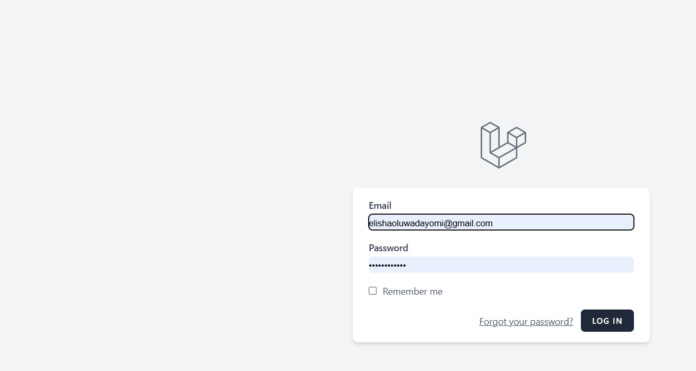
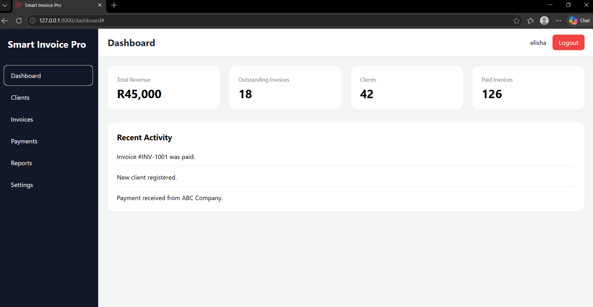

# Smart Invoice Pro

Smart Invoice Pro is a full-stack business management application built with Laravel. The project is designed to provide businesses with a centralised system for managing clients and invoicing workflows.

The application is being developed as a production-oriented portfolio project to demonstrate practical full-stack software development, database design, authentication, business logic and responsive user interface development.

## 🚀 Project Status

**In active development**

Current development includes:

* User authentication
* Dashboard
* Client management
* Company-based application structure
* Database-driven workflows
* Responsive user interface

Additional invoicing functionality is being developed as part of the project roadmap.

---

## 🛠️ Technology Stack

### Backend

* PHP
* Laravel

### Frontend

* Livewire
* Tailwind CSS
* JavaScript
* Vite

### Database

* SQLite

### Development Tools

* Git
* GitHub
* Visual Studio Code
* Composer
* NPM

---
## 📸 Application Screenshots

### Login



### Dashboard




## ✨ Current Features

### Authentication

The application includes user authentication and protected application areas.

### Dashboard

A responsive application dashboard provides the central interface for accessing system functionality.

### Client Management

Users can manage client records through the application.

Current functionality includes:

* Create clients
* View clients
* Edit clients
* Delete clients
* View client details

### Company Structure

The application is being developed with company-based data relationships to support business users and their associated records.

---

## 🏗️ Application Architecture

Smart Invoice Pro follows Laravel's MVC architecture and separates application responsibilities across models, views, controllers and supporting application services.

### High-Level Structure
```text
User
 │
 ▼
Authentication
 │
 ▼
Dashboard
 │
 ├── Companies
 │
 ├── Clients
 │
 └── Invoices
       │
       ├── Invoice Items
       ├── Calculations
       └── PDF Generation
```
---


## 🗄️ Database

## 🗄️ Database

The application currently uses SQLite for development.

The database is managed through Laravel migrations and Eloquent models.

### Current Core Entities
```text
Users
 │
 └── Companies
       │
       └── Clients
```
---

## 💻 Local Installation

### Requirements

Before installing the application, ensure you have:

* PHP
* Composer
* Node.js and NPM
* SQLite
* Git

### Clone the repository

```bash
git clone https://github.com/YOUR-USERNAME/smart-invoice-pro.git
```

Navigate into the project:

```bash
cd smart-invoice-pro
```

Install PHP dependencies:

```bash
composer install
```

Install frontend dependencies:

```bash
npm install
```

Create the environment file:

```bash
cp .env.example .env
```

Generate the Laravel application key:

```bash
php artisan key:generate
```

Run migrations:

```bash
php artisan migrate
```

Build frontend assets:

```bash
npm run build
```

Start the Laravel development server:

```bash
php artisan serve
```

---

## 🔐 Environment Configuration

Sensitive environment configuration is stored in the `.env` file.

The `.env` file is intentionally excluded from version control.

Developers should create their own `.env` file using:

```text
.env.example
```

---

## ✨ Current Features

| Feature | Status | Description |
|---|---|---|
| User Authentication | ✅ Complete | User registration, login and protected application access |
| Dashboard | ✅ Complete | Central dashboard for accessing application functionality |
| Client Management | ✅ Complete | Create, view, edit and delete client records |
| Client Details | ✅ Complete | View individual client information |
| Company Structure | 🚧 In Development | Associates application records with companies |
| Invoice Management | 🚧 Planned | Create and manage invoices |
| Invoice Items | 🚧 Planned | Add products/services to invoices |
| Invoice Calculations | 🚧 Planned | Calculate subtotals, totals and invoice amounts |
| PDF Generation | 🚧 Planned | Generate downloadable PDF invoices |
| Invoice History | 🚧 Planned | Track invoices associated with clients |
| Dashboard Analytics | 🚧 Planned | Display business and invoice statistics |


##  Development Roadmap

### Phase 1 — Foundation
- [x] Laravel application setup
- [x] Authentication
- [x] Dashboard
- [x] Application layout
- [x] Git/GitHub integration

### Phase 2 — Client Management
- [x] Client database structure
- [x] Create clients
- [x] View clients
- [x] Edit clients
- [x] Delete clients
- [x] Client details

### Phase 3 — Invoice Management
- [ ] Invoice database structure
- [ ] Invoice creation
- [ ] Invoice editing
- [ ] Invoice deletion
- [ ] Invoice items
- [ ] Invoice calculations
- [ ] Invoice status

### Phase 4 — Document Generation
- [ ] PDF invoice generation
- [ ] Invoice download
- [ ] Printable invoices

### Phase 5 — Dashboard & Reporting
- [ ] Invoice statistics
- [ ] Revenue metrics
- [ ] Client statistics
- [ ] Recent invoices
- [ ] Invoice status overview

### Phase 6 — Quality & Production
- [ ] Form validation
- [ ] Authorization
- [ ] Automated testing
- [ ] Error handling
- [ ] Production deployment
- [ ] Production database configuration

---

## 🎯 Project Goals

Smart Invoice Pro is being developed to demonstrate practical software engineering skills including:

* Full-stack web development
* Laravel application architecture
* Database design
* Authentication and authorization
* CRUD development
* Business logic
* Responsive interface development
* Git version control
* Software testing
* Production deployment

---

## 👨‍💻 Developer

**Elisha Oluwadayomi**

Full-Stack Software Developer | IT Professional

Portfolio: https://elishakhizs.github.io/

GitHub: https://github.com/elishkhizs

LinkedIn: www.linkedin.com/in/elisha-oluwadayomi-693a23336
