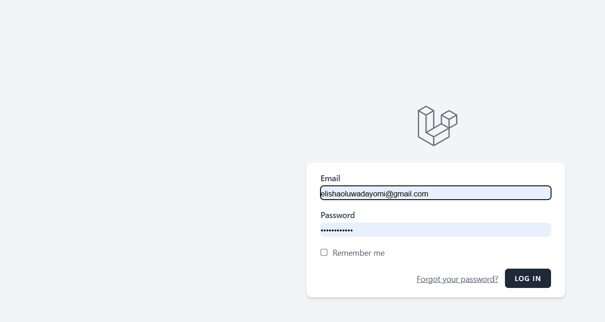
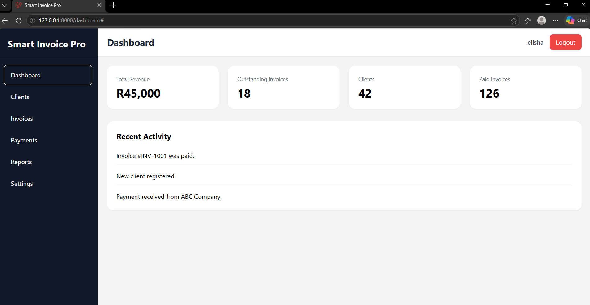
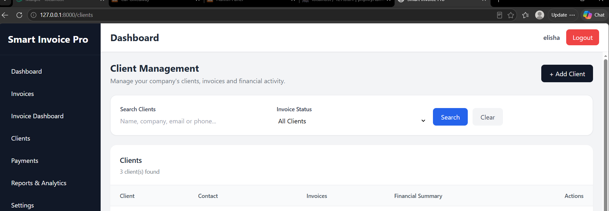
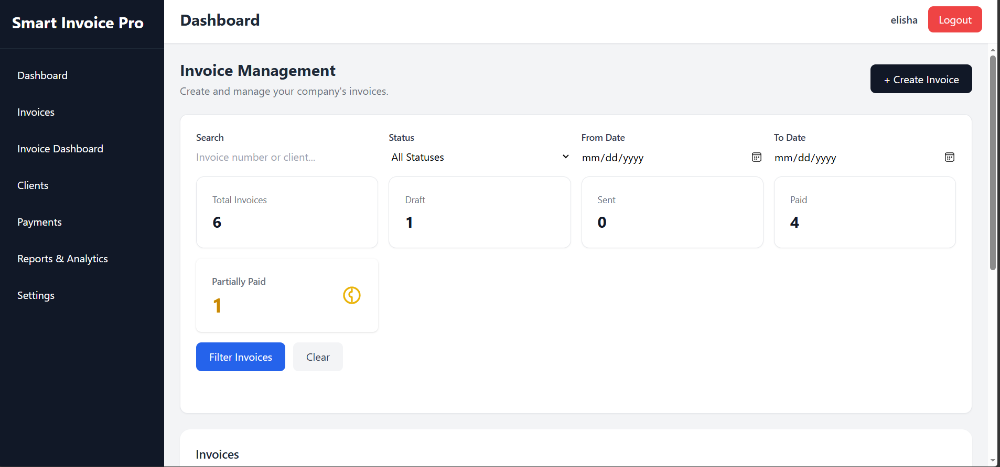
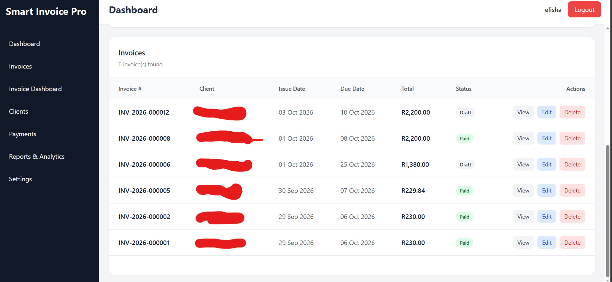
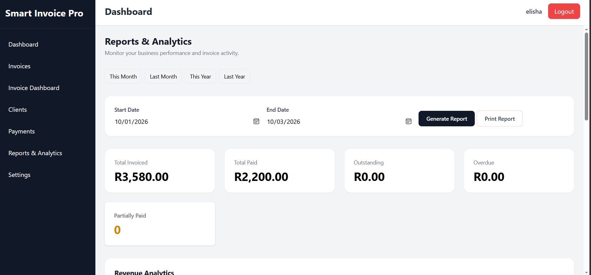
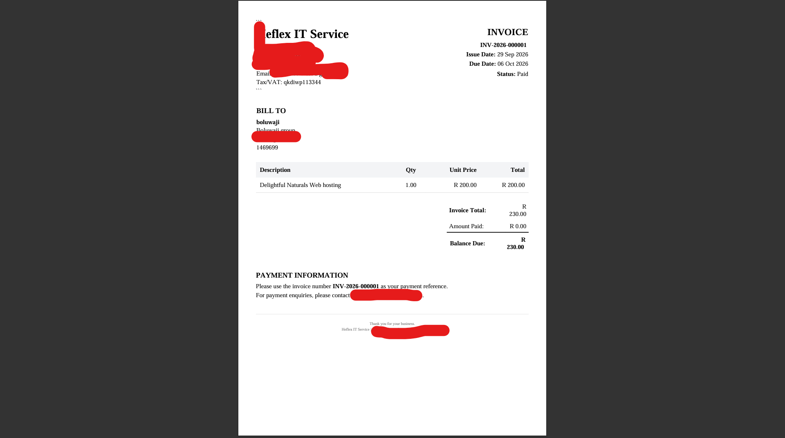

# Smart Invoice Pro

Smart Invoice Pro is a full-stack business management and invoicing application built with Laravel. The application provides businesses with a centralised system for managing clients, creating invoices, recording payments, generating financial documents and monitoring business activity.

The project is developed as a production-oriented portfolio application demonstrating practical full-stack software development, database design, authentication, authorization, business logic, financial calculations, PDF generation, email integration, reporting and responsive user interface development.

---

## 🚀 Project Status

**Portfolio Release Candidate — Core Features Complete**

The core application functionality has been implemented and tested, including:

* User authentication
* Company-based data isolation
* Company profile management
* Client management
* Invoice management
* Invoice line items
* Automatic invoice numbering
* Invoice calculations
* Payment management
* Partial and full payments
* Automatic invoice payment status synchronization
* Invoice PDF generation
* Invoice email delivery
* Financial dashboard
* Financial reporting
* Client financial summaries
* Payment history
* Outstanding balance tracking
* Overdue invoice tracking
* Search and filtering
* Authorization and company-level access control

---

## 🛠️ Technology Stack

### Backend

* PHP
* Laravel
* Eloquent ORM
* Laravel Breeze
* Laravel Mail

### Frontend

* Blade
* Livewire
* Tailwind CSS
* JavaScript
* Vite

### Database

* SQLite

### Document & Communication

* DomPDF
* Laravel Mail
* PDF invoice generation
* Email invoice delivery

### Development Tools

* Git
* GitHub
* Visual Studio Code
* Composer
* NPM

---

## 📸 Application Screenshots

### Login



### Dashboard



### Client Management



### Invoice Management



### Invoice Details



### Financial Reports



### Invoice PDF



---

# ✨ Features

## 🔐 Authentication & Access Control

The application includes protected user authentication and company-based access control.

Features include:

* User registration
* User login
* User logout
* Protected application routes
* Authenticated dashboard access
* Company-based record ownership
* Authorization checks for invoices
* Authorization checks for clients
* Authorization checks for payments

---

## 🏢 Company Management

Smart Invoice Pro uses a company-based structure to associate users and business records.

Company information can be managed through the application.

Supported company information includes:

* Company name
* Business email
* Phone number
* Address
* City
* Country
* Tax/VAT number

Company information is also used when generating professional invoices and invoice PDFs.

---

## 👥 Client Management

Users can manage their business clients through the application.

Current functionality includes:

* Create clients
* View clients
* Edit clients
* Delete clients
* Client details
* Client search
* Client filtering
* Client invoice history
* Client financial summaries
* Client payment history
* Total invoiced per client
* Total paid per client
* Outstanding balances
* Overdue balances

Client records are associated with the authenticated user's company.

---

## 🧾 Invoice Management

Smart Invoice Pro provides a complete invoice management workflow.

Features include:

* Create invoices
* View invoices
* Edit invoices
* Delete invoices
* Search invoices
* Filter invoices by status
* Automatic invoice numbering
* Invoice issue dates
* Invoice due dates
* Invoice notes
* Client association
* Company association
* Invoice status management

Supported invoice statuses include:

* Draft
* Sent
* Partially Paid
* Paid

Invoice numbers are automatically generated using a company-specific yearly sequence.

Example:

```text
INV-2026-000001
INV-2026-000002
INV-2026-000003
```

---

## 🛒 Invoice Items & Calculations

Invoices support multiple line items.

Each invoice item includes:

* Description
* Quantity
* Unit price
* Line total

The application automatically calculates:

```text
Subtotal
   +
Tax
   =
Invoice Total
```

This allows invoices to contain multiple products or services while keeping calculations centralised within the application.

---

## 💳 Payment Management

Smart Invoice Pro includes payment tracking for invoices.

Users can:

* Record payments
* Edit payments
* Delete payments
* Record payment dates
* Record payment methods
* Add payment references
* Add payment notes
* Track partial payments
* Track fully paid invoices
* View payment history

The application prevents payments from exceeding the remaining invoice balance.

### Payment Status Synchronization

Invoice payment status is automatically calculated from recorded payments.

For example:

```text
Invoice Total:    R2,200
Payment:          R500

Status:           Partially Paid
Balance:          R1,700
```

After the remaining payment:

```text
Invoice Total:    R2,200
Total Paid:       R2,200

Status:           Paid
Balance:          R0
```

Deleting or editing a payment automatically recalculates the invoice payment status.

---

## 📄 PDF Invoice Generation

The application can generate professional PDF invoices.

Generated invoices include:

* Company information
* Client information
* Invoice number
* Issue date
* Due date
* Invoice items
* Subtotal
* Tax
* Total
* Payment history
* Amount paid
* Outstanding balance
* Payment status
* Company contact information

Invoices can be downloaded using their invoice number.

---

## 📧 Invoice Email Delivery

Invoices can also be sent directly to clients by email.

The email workflow includes:

* Client email delivery
* Invoice information
* Amount due
* Payment status
* Company contact information
* Automatically generated PDF attachment

The generated PDF invoice is attached directly to the email.

---

## 📊 Dashboard

Smart Invoice Pro includes a dedicated invoicing and financial dashboard.

The dashboard provides an overview of:

* Total invoices
* Total invoiced
* Total paid
* Outstanding balances
* Overdue balances
* Draft invoices
* Sent invoices
* Partially paid invoices
* Paid invoices
* Recent payments
* Recent invoices
* Upcoming due invoices
* Revenue activity

The dashboard also provides quick access to:

* Create Invoice
* Manage Clients
* View Reports
* Company Settings

---

## 📈 Financial Reporting

The reporting module provides financial information over selected date ranges.

Reports include:

* Total invoices
* Draft invoices
* Sent invoices
* Partially paid invoices
* Paid invoices
* Total invoiced
* Total paid
* Outstanding balances
* Overdue balances
* Total clients
* Monthly revenue
* Revenue by client
* Invoice status analysis

Reports can be filtered using custom date ranges.

The reporting interface also includes visual representations of financial activity and print-friendly reporting.

---

## 🔎 Search & Filtering

The application provides search and filtering functionality for business records.

### Clients

Users can search clients by:

* Name
* Email
* Phone
* Company name

### Invoices

Users can search invoices by:

* Invoice number
* Client name
* Client company

Invoices can also be filtered by status, including overdue invoices.

---

# 🏗️ Application Architecture

Smart Invoice Pro follows Laravel's MVC architecture and uses Eloquent relationships to connect business entities.

### High-Level Structure

```text
User
 │
 ▼
Company
 │
 ├── Clients
 │    │
 │    └── Invoices
 │         │
 │         ├── Invoice Items
 │         │
 │         └── Payments
 │
 ├── Invoices
 │
 └── Company Settings
```

### Application Workflow

```text
Authentication
      │
      ▼
Company
      │
      ├───────────────┐
      ▼               ▼
   Clients        Invoices
                      │
             ┌────────┼────────┐
             ▼        ▼        ▼
          Items    Payments   PDF
                               │
                               ▼
                             Email
```

---

# 🗄️ Database

The application currently uses SQLite for local development.

Database structure is managed using Laravel migrations and Eloquent models.

### Core Entities

```text
Users
 │
 └── Companies
       │
       ├── Clients
       │    └── Invoices
       │         ├── Invoice Items
       │         └── Payments
       │
       └── Invoices
```

### Key Relationships

```text
Company
 ├── hasMany Users
 ├── hasMany Clients
 └── hasMany Invoices

Client
 ├── belongsTo Company
 └── hasMany Invoices

Invoice
 ├── belongsTo Company
 ├── belongsTo Client
 ├── hasMany Invoice Items
 └── hasMany Payments

Payment
 ├── belongsTo Company
 └── belongsTo Invoice
```

---

# 🔐 Security & Data Isolation

Smart Invoice Pro uses company-level data isolation.

Authenticated users can only access records belonging to their company.

Authorization checks are applied to:

* Clients
* Invoices
* Payments
* Company records

The application also validates relationships when creating and updating records.

For example, an invoice cannot be assigned to a client belonging to another company.

This provides an additional layer of protection for multi-company business data.

---

# 💻 Local Installation

## Requirements

Before installing the application, ensure you have:

* PHP 8.2+
* Composer
* Node.js
* NPM
* SQLite
* Git

### Clone the repository

```bash
git clone https://github.com/elishkhizs/smart-invoice-pro.git
```

Navigate into the project:

```bash
cd smart-invoice-pro
```

Install PHP dependencies:

```bash
composer install
```

Install frontend dependencies:

```bash
npm install
```

Create the environment file:

```bash
cp .env.example .env
```

Generate the Laravel application key:

```bash
php artisan key:generate
```

Create the SQLite database:

```bash
touch database/database.sqlite
```

Run migrations:

```bash
php artisan migrate
```

Build frontend assets:

```bash
npm run build
```

Start the Laravel development server:

```bash
php artisan serve
```

The application will be available at:

```text
http://127.0.0.1:8000
```

---

# 🔐 Environment Configuration

Sensitive environment configuration is stored in the `.env` file.

The `.env` file is intentionally excluded from version control.

Developers should create their own `.env` file using:

```text
.env.example
```

Environment configuration may include:

* Application key
* Database configuration
* Mail configuration
* SMTP credentials

Never commit production credentials or sensitive environment variables to the repository.

---

# 📋 Feature Status

| Feature                  | Status                | Description                                          |
| ------------------------ | --------------------- | ---------------------------------------------------- |
| User Authentication      | ✅ Complete            | Registration, login, logout and protected routes     |
| Company Management       | ✅ Complete            | Business information and company relationships       |
| Company Data Isolation   | ✅ Complete            | Company-level record access control                  |
| Client Management        | ✅ Complete            | Create, view, edit and delete clients                |
| Client Search            | ✅ Complete            | Search and filter client records                     |
| Client Financial Summary | ✅ Complete            | Invoice, payment and outstanding balance information |
| Invoice Management       | ✅ Complete            | Create, view, edit, delete and search invoices       |
| Invoice Items            | ✅ Complete            | Multiple products/services per invoice               |
| Invoice Calculations     | ✅ Complete            | Subtotal, tax and total calculations                 |
| Invoice Numbering        | ✅ Complete            | Automatic company/year invoice numbering             |
| Invoice Status           | ✅ Complete            | Draft, sent, partial and paid                        |
| Payment Management       | ✅ Complete            | Create, edit and delete payments                     |
| Payment Validation       | ✅ Complete            | Prevents payments exceeding invoice balance          |
| Payment Status Sync      | ✅ Complete            | Automatically synchronizes invoice payment status    |
| Payment History          | ✅ Complete            | Payment records linked to invoices and clients       |
| PDF Generation           | ✅ Complete            | Professional downloadable invoice PDFs               |
| Invoice Email            | ✅ Complete            | Email invoice with PDF attachment                    |
| Financial Dashboard      | ✅ Complete            | Financial overview and business activity             |
| Upcoming Due Invoices    | ✅ Complete            | Displays upcoming outstanding invoices               |
| Financial Reports        | ✅ Complete            | Date-filtered financial reporting                    |
| Revenue Analysis         | ✅ Complete            | Monthly and client revenue analysis                  |
| Search & Filtering       | ✅ Complete            | Client and invoice search/filtering                  |
| Authorization            | ✅ Complete            | Company-level access protection                      |
| Responsive UI            | ✅ Complete            | Responsive Tailwind CSS interface                    |
| Automated Testing        | 🔄 Future Enhancement | Expand automated feature and integration tests       |
| Online Payments          | 🔄 Future Enhancement | Integrate online payment providers                   |
| Recurring Invoices       | 🔄 Future Enhancement | Automated recurring billing                          |
| Expense Tracking         | 🔄 Future Enhancement | Business expense management                          |
| Advanced User Roles      | 🔄 Future Enhancement | Multi-user roles and permissions                     |
| Production Deployment    | 🔄 Future Enhancement | Deploy to production infrastructure                  |

---

# 🗺️ Development Roadmap

## Phase 1 — Foundation

* [x] Laravel application setup
* [x] Authentication
* [x] Dashboard
* [x] Application layout
* [x] Git/GitHub integration

## Phase 2 — Company & Client Management

* [x] Company database structure
* [x] Company settings
* [x] Company relationships
* [x] Client database structure
* [x] Create clients
* [x] View clients
* [x] Edit clients
* [x] Delete clients
* [x] Client details
* [x] Client search
* [x] Client financial information

## Phase 3 — Invoice Management

* [x] Invoice database structure
* [x] Invoice creation
* [x] Invoice editing
* [x] Invoice deletion
* [x] Invoice items
* [x] Invoice calculations
* [x] Invoice numbering
* [x] Invoice status management
* [x] Invoice search
* [x] Invoice filtering

## Phase 4 — Payment Management

* [x] Payment database structure
* [x] Record payments
* [x] Edit payments
* [x] Delete payments
* [x] Partial payments
* [x] Full payments
* [x] Payment validation
* [x] Payment history
* [x] Automatic payment status synchronization
* [x] Outstanding balance calculations
* [x] Overdue balance calculations

## Phase 5 — Documents & Communication

* [x] PDF invoice generation
* [x] Invoice download
* [x] Professional invoice layout
* [x] Invoice email delivery
* [x] PDF email attachment

## Phase 6 — Dashboard & Reporting

* [x] Invoice statistics
* [x] Revenue metrics
* [x] Client statistics
* [x] Recent invoices
* [x] Recent payments
* [x] Upcoming due invoices
* [x] Invoice status overview
* [x] Financial reports
* [x] Revenue by client
* [x] Date-range reporting

## Phase 7 — Security & Quality

* [x] Form validation
* [x] Authorization
* [x] Company-level data isolation
* [x] Invoice ownership validation
* [x] Client ownership validation
* [x] Payment ownership validation
* [x] Financial consistency checks
* [x] Error handling
* [x] Application testing

## Phase 8 — Future Enhancements

* [ ] Automated test suite expansion
* [ ] Online payment integration
* [ ] Recurring invoices
* [ ] Expense tracking
* [ ] Advanced user roles
* [ ] Invoice templates
* [ ] Automated payment reminders
* [ ] Cloud file storage
* [ ] Production deployment
* [ ] Production database configuration

---

# 🎯 Project Goals

Smart Invoice Pro was developed to demonstrate practical software engineering skills including:

* Full-stack web development
* Laravel application architecture
* MVC architecture
* Database design
* Eloquent relationships
* Authentication
* Authorization
* Company-level data isolation
* CRUD development
* Business logic
* Financial calculations
* Payment processing
* PDF generation
* Email integration
* Reporting
* Responsive interface development
* Git version control
* Application testing
* Production-oriented development

The project focuses on solving a realistic business problem rather than demonstrating isolated technical features.

---

# 👨‍💻 Developer

**Elisha Oluwadayomi**

**Full-Stack Software Developer | IT Professional**

Portfolio:
https://elishakhizs.github.io/

GitHub:
https://github.com/elishkhizs

LinkedIn:
https://www.linkedin.com/in/elisha-oluwadayomi-693a23336
